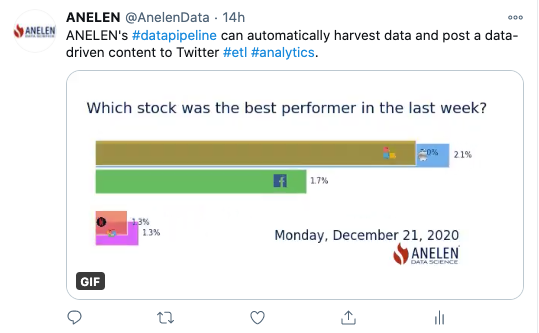

# Stock price bar chart race

Fetch stock price data from Yahoo! Finance, create a GIF animation, and post
on Twitter.

Click to go to the animated GIF on Twitter:
[](https://twitter.com/AnelenData/status/1343648915271380995)

## Files

```
stock-race/
├── deploy
│   └── Dockerfile
├── files
│   ├── AAPL.png
│   ├── config.json
│   ├── FB.png
│   ├── GOOG.png
│   ├── logo.png (replace logo)
│   ├── MSFT.png
│   ├── NFLX.png
│   ├── scripts
│   │   ├── make_gif.py
│   │   └── tweet.py
│   └── twitter_config.json (edit the message)
├── project.yml
├── README.md
├── .secrets
│   └── secrets.yml (edit this)
└── stock.gif
```

After the necessary parameters are set, do:

```
cd stock-race
handoff --project . --workspace workspace workspace install
handoff -p . -w workspace run local
```

to run locally.

Example deployment command sequence to AWS Fargate:

Note: This project uses a non-standard Docker image. (the 4th line)

```
export AWS_PROFILE=your-profile
handoff cloud create bucket --project . --stage prod
handoff project push -p . -s prod
handoff container build -p . -v docker_file=deploy/Dockerfile
handoff container push -p .
handoff cloud resources create -p . -s prod
handoff cloud task create -p . -s prod
handoff cloud run -p . -s prod  # Run now
handoff cloud schedule -p . -s prod  # Schedule
```

