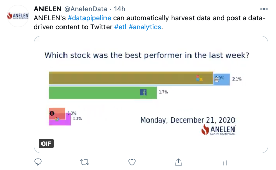

# Stock price bar chart race

Fetch stock price data from Yahoo! Finance, create a GIF animation, and post
on Twitter.

Click to go to the animated GIF on Twitter:
[](https://twitter.com/AnelenData/status/1343648915271380995)

## Files

```
stock-race/
├── deploy
│   └── Dockerfile
├── files
│   ├── AAPL.png
│   ├── config.json
│   ├── FB.png
│   ├── GOOG.png
│   ├── logo.png (replace logo)
│   ├── MSFT.png
│   ├── NFLX.png
│   ├── scripts
│   │   ├── make_gif.py
│   │   └── tweet.py
│   └── twitter_config.json (edit the message)
├── project.yml
├── README.md
├── .secrets
│   └── secrets.yml (edit this)
└── stock.gif
```

## Build container

This project uses a non-standard Docker image. To build, do this:

```
cd stock-race
handoff container build -p . -v docker_file=deploy/Dockerfile
```
